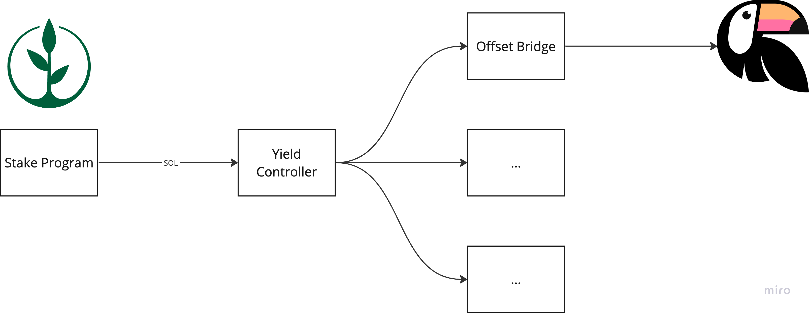

# Yield Controller

The Sunrise Stake Yield Controller is a suite of Solana programs that control
the distribution of staking yield from the Sunrise Stake program to climate projects.

The current yield distribution mechanism of Sunrise buys and retires 
[Toucan NCT carbon tokens](https://blog.toucan.earth/announcing-nct-nature-carbon-tonne/),
however the target model is to diversify the yield distribution to a range of climate
projects, controlled by a DAO.

## History

### 1. Initial release - Toucan NCT Buy-Burn-Fixed

The initial version of the Sunrise Yield Controller used the Buy-Burn-Fixed strategy to
distribute yield. This strategy was implemented in the `buy-burn-fixed` package.

The `buy_burn_fixed` strategy bought Toucan NCT tokens at a fixed price and burned them. 
The Toucan NCT tokens were bridged from Polygon manually via [Wormhole](https://wormhole.com/) and
stored in a PDA owned by the program.

The price of NCT was manually updated periodically by a Sunrise administrator in order to ensure
a fair price was paid by Sunrise for the Toucan NCT tokens.

This had a number of downsides:
- The price of NCT was manually updated, which was a centralised process.
- NCT had to be manually bridged from Polygon to Solana, also a centralised process.
- Bridged NCT was burned, rather than retired via Toucan, which reduced the transparency of the process, and
  meant that the off-chain registries could not be updated.
- Yield distribution was limited to Toucan NCT tokens.

### 2. Toucan NCT Buy-Burn-Switchboard

The second version used a price oracle set up on [Switchboard](https://switchboard.xyz/) to 
determine the correct NCT price. This reduced the ability of administrators to control the price, but
did not affect the other downsides of release 1.

### 3. Offset Bridge

The third version of the yield controller replaced the buy-burn mechanism for a bridge-buy-retire mechanism
called the Offset Bridge.

Rather than manually bridging NCT to Solana, and having the yield controller buy and burn it, instead
a new system - the [offset bridge](https://github.com/sunrise-stake/offset-bridge) - was set up to
bridge funds to Polygon, store them in a smart contract wallet, and automatically retire them via Toucan.

This ensured that NCT was correctly converted to tCO2 tokens and retired against the Toucan registry,
while ensuring the funds remained in control of the protocol (not touching EOA wallets), but nonetheless
had a number of "crank" steps that, while permissionless, still needed manual involvement to perform.

Details of the Offset Bridge can be found in the [Offset Bridge README](https://github.com/sunrise-stake/offset-bridge/blob/main/README.md).

At present, this is the current mechanism for yield distribution in Sunrise.
It uses the "Yield Router" program to route yield from the Sunrise Stake program to the Offset Bridge.

### 4. (Planned) Diversified Yield Router

The current implementation of the yield controller sends all funds from the Sunrise program directly to
a PDA owned by the Offset Bridge using the Yield Router, however the Yield Router only has one destination,
the offset bridge.

The next step will be to adapt the router to support additional distribution of yield to a range of
climate projects, rather than just NCT.

The architecture is as follows:
- Sunrise Stake program sends yield to a PDA owned by the Yield Router program (as at present).
- Yield Router owns a [State account](https://solscan.io/account/6Uad9j9DpKE9Jhebb5T3vWNWuCYTP7XxG6LJBPaqJB31),
  which contains a list of destinations and their allocation percentage
- The Yield Router `allocate_yield` instruction shares yield across the destinations according to their
  allocation percentage.
- Each destination is expected to be a PDA that then distributes the yield to the climate project
  according to their own rules. For example, the Offset Bridge bridges the funds to Polygon, buys
  NCT etc.
