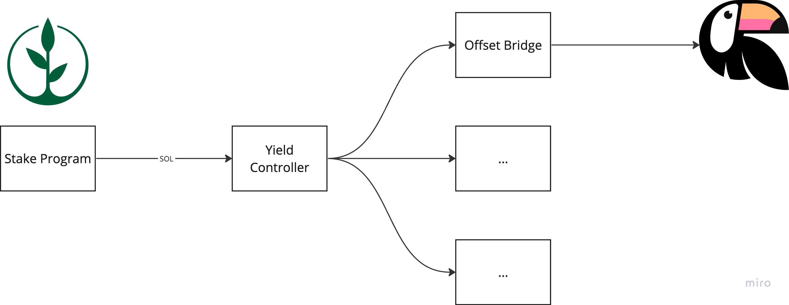
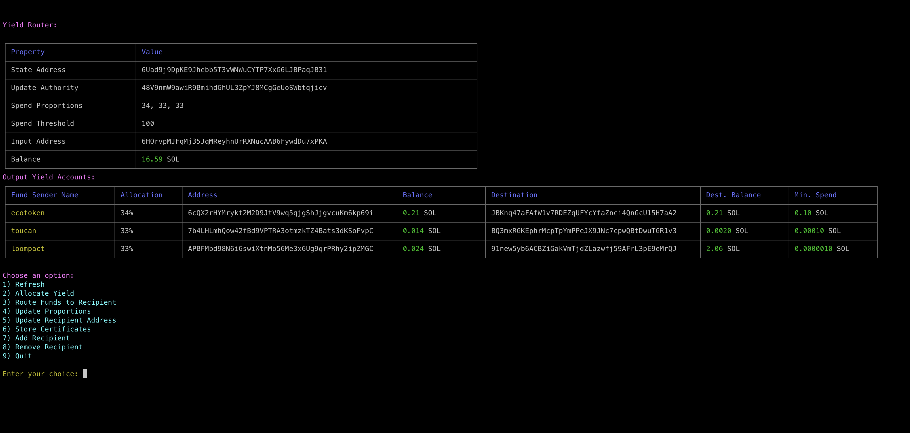
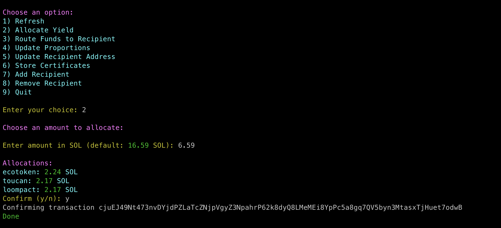
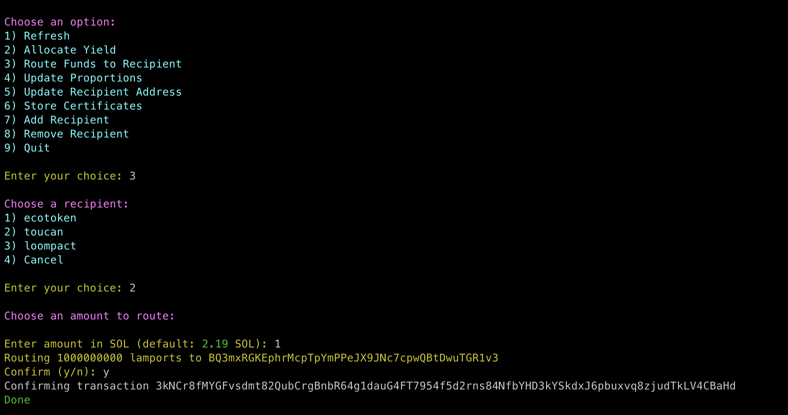
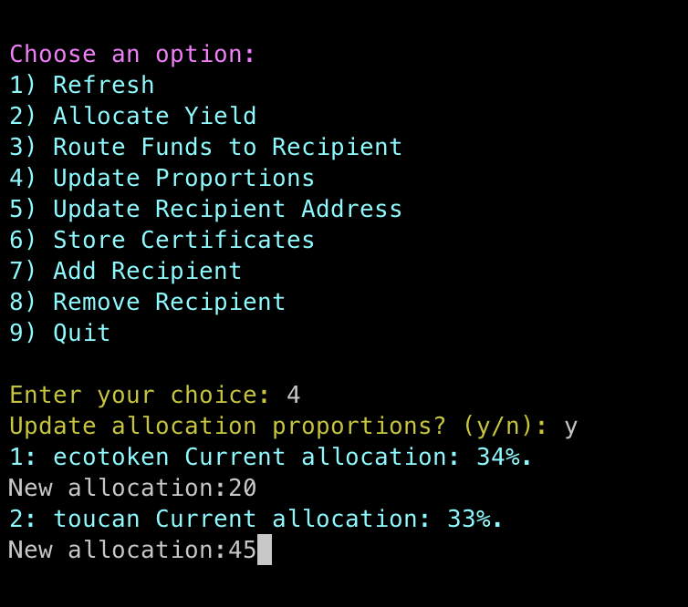

# Yield Controller

The Sunrise Stake **Yield Controller** is a suite of Solana programs that govern
how staking yield from the Sunrise Stake program is distributed to climate projects.

The current (v4) architecture **diversifies** yield routing to multiple potential recipients,
each handling its own off-chain or on-chain distribution rules.

## The Diversified Yield Router



1. The **Sunrise Stake** program sends yield to a **PDA** owned by the **Yield Router** program.
2. The Yield Router stores a **State account**, which includes a list of **destinations** and their **allocation percentages**.
3. When the `allocate_yield` instruction is called, the Yield Router **splits** incoming yield across the destinations according to each allocation percentage.
4. Each destination is typically another **PDA** that manages how to route funds
5. to a specific climate project (e.g., bridging, retiring carbon credits, or other actions).

## Usage

The **Yield Controller Management Portal** is a CLI application can be used both to monitor and adjust yield routing within Sunrise Stake.

Its intended users are:
- **Administrators**: Who can adjust allocation percentages, add or remove recipients, and update recipient addresses.
- **Observers**: Who can view the current state of the system and the allocation percentages.
- **Crank-turners**: Who can trigger the allocation of yield to recipients, and return of carbon retirement certificates to Sunrise, but only according to the configuration set by the administrators. 

This section describes how to use the management portal to monitor and configure yield routing.

### 1. Clone the Repository

```sh
git clone https://github.com/sunrisestake/yield-controller.git
cd yield-controller
```

### 2. Set Environment Variables

- **ANCHOR_PROVIDER_URL**: Point this to a valid Solana mainnet RPC URL.
- **ANCHOR_WALLET**: Point this to your local wallet keypair file.

> **Tip:** In **read-only mode**, you can use any wallet address (no funds required).

### 3. Install Dependencies

```sh
yarn install
```

### 4. Start the Management Portal

```sh
yarn manager
```

### Dashboard Overview

Once the portal starts, you’ll see the **main dashboard**:



The **dashboard** shows the current on-chain configuration of the Sunrise Stake yield router, including:
- The **current recipients** of funds.
- The **amount of funds** waiting to be allocated.
- Each recipient’s **allocation percentage**.

### Operations

The **Yield Controller Management Portal** supports the following operations, split into two categories: **permissionless** and **admin-only**.
- **Permissionless** operations can be performed by anyone, such as "crank-turning" operations - allocating yield to recipients and storing certificates.
- **Admin-only** operations require the **admin** keypair to be present in the environment.

1. **Yield Allocation** (Permissionless)

This is the most frequent operation, where funds are extracted from the Sunrise Pool and routed to an intermediary account for each recipient, based on the current allocation percentages.

Funds are not sent to the recipients immediately, rather they are passed to an intermediary account.
This is done to allow controlled releases of funds, considering liquidity or other constraints.



2. **Route Funds to Recipients** (Permissionless)

After yield is allocated to intermediary accounts, this operation sends funds to the recipients.



3. **Update Proportions** (Admin Only)

Adjust the **allocation percentages** for each recipient.



4. **Update Recipient Addresses** (Admin Only)

Modify the **destination addresses** where allocated yield is eventually sent.

5. **Add or Remove Recipients** (Admin Only)

Includes or removes recipients from the overall yield distribution list.

6. **Store Certificates** (Permissionless)

Moves **carbon credit retirement NFTs** back to the Sunrise Treasury after receipt from climate projects.

## History

The Sunrise Stake **Yield Controller** has undergone several iterations to improve its functionality and decentralization.

### 1. Initial Release: Toucan NCT Buy-Burn-Fixed

- Used the `buy_burn_fixed` strategy to buy and burn **Toucan NCT** tokens at a **fixed price**.
- **NCT** was manually bridged from Polygon to Solana and stored in a PDA.
- **Downsides** included centralization (manual price updates, manual bridging) and lack of off-chain transparency (no official Toucan registry updates).

### 2. Toucan NCT Buy-Burn-Switchboard

- Replaced the manual pricing with a **Switchboard** oracle for **NCT price**.
- Other downsides of the initial release persisted.

### 3. Offset Bridge

- Introduced a **bridge-buy-retire** flow using the [Offset Bridge](https://github.com/sunrise-stake/offset-bridge).
- Yield was routed to Polygon, where **NCT** was automatically purchased and **retired** via Toucan.
- Required several **“crank” steps** to complete the process, though still permissionless.

### 4. Diversified Yield Router (Current)

- Uses the **Yield Router** program to route yield from Sunrise Stake to multiple PDAs, each representing a different climate project or offset approach.
- Allows the protocol to expand beyond **Toucan NCT**.
